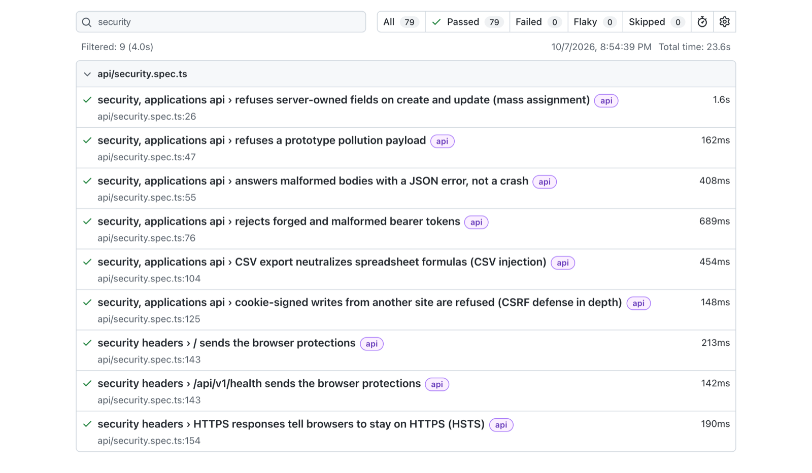

# Quality Engineering Lab

[](https://github.com/emaxiss/quality-engineering-lab/actions/workflows/nightly.yml) [](https://github.com/emaxiss/quality-engineering-lab/actions/workflows/checks.yml)

Playwright and TypeScript test suites for a live SaaS web application, a job application tracker, through its UI and its REST API (`/api/v1`). The full suite runs every night against production.

**Application under test:** https://rolequeue.vercel.app. Anyone can sign up, or use "Try the demo" for a private account with sample data.

<p align="center">
  
</p>

## Highlights

- **Bugs found in production, then guarded.** A logout that did not end the session, an open redirect after login, a session cookie readable by page scripts, and three WCAG contrast failures. Each was caught by a test, and each test now guards the fix.
- **Strict API checks.** Every response body is parsed with a strict Zod schema, so a field that appears, disappears or changes type fails the test. A second account tries to read, update and delete the first account's data, and must get 404 every time.
- **Release safety.** Pact contracts verified against the live API, and upgrade tests that prove a database migration keeps every record, figure and access rule.

## A defect, caught

`POST /api/v1/auth/logout` answered 204, but the bearer token kept authorizing requests for about an hour. The test asserted the correct behavior under `test.fail()`, so the suite stayed green while the defect existed. When the fix shipped, the run reported "expected to fail, but passed", the marker came off, and the test now guards against the defect coming back.

More in [Findings and decisions](docs/findings.md).

## What is here

| Area | What is here | Start with |
| --- | --- | --- |
| **UI automation** | Page objects and fixtures, locators by role and accessible name only, Chromium by default with Firefox, WebKit and a mobile viewport on demand | `src/pages/`, `tests/ui/` |
| **API automation** | Endpoint clients that return raw responses, so status codes and error envelopes are part of every check | `src/api/`, `tests/api/` |
| **Response schemas** | A strict Zod schema for every response body; TypeScript types inferred from the same schemas | `src/api/schemas.ts` |
| **Authorization** | Cross-account reads, searches, exports, updates and deletes must answer 404 and leave the owner's record unchanged | `tests/api/isolation.spec.ts` |
| **Security** | OWASP Top 10 checks: mass assignment, forged tokens, CSV formula injection, cross-site writes, cookie flags, security headers, open redirect | `tests/api/security.spec.ts` |
| **Contract testing** | Pact v4 consumer contract, verified against the live API with state handlers | `tests/contract/` |
| **Accessibility** | axe scans against WCAG 2.2 AA with a known-issue list that cannot go stale, plus keyboard-only flows | `tests/a11y/`, `tests/ui/keyboard.spec.ts` |
| **Database migrations** | Seed and snapshot before a release, verify every record after it | `tests/migration/` |
| **CI quality gates** | Types, type-aware ESLint and Prettier on every pull request, the full suite nightly against production, CodeQL | `.github/workflows/` |

## Latest run

```text
$ pnpm test
Running 79 tests using 2 workers
  79 passed (48.3s)
```

Nightly run of 2026-10-07 against production. Every test creates uniquely named data and deletes it when it ends, so the test accounts hold no records after a run.

## Status

**In place:** UI smoke suite, keyboard-only flows, API suite with response schemas, security checks, cross-user isolation, Pact contracts, WCAG scans, database upgrade tests, pull request checks, and the nightly run against production.

**Planned:** UI flows beyond the smoke suite, k6 performance tests, visual regression, screen reader flows, and more security cases (session expiry, stored script injection, rate limits).

## Quick start

Requires Node.js 20.19+, pnpm 10, and two accounts in the application under test.

```bash
pnpm install
pnpm browsers
cp .env.example .env   # then fill in both accounts
pnpm test
```

## Docs

- [Running the suites](docs/running.md): environment variables, scripts, CI
- [Architecture](docs/architecture.md): folders, page objects, fixtures, Playwright projects
- [Test suites](docs/suites.md): smoke, API, contract and accessibility coverage
- [Database migration tests](docs/migrations.md): how an upgrade test works and how to run one
- [Findings and decisions](docs/findings.md): what testing this application surfaced
